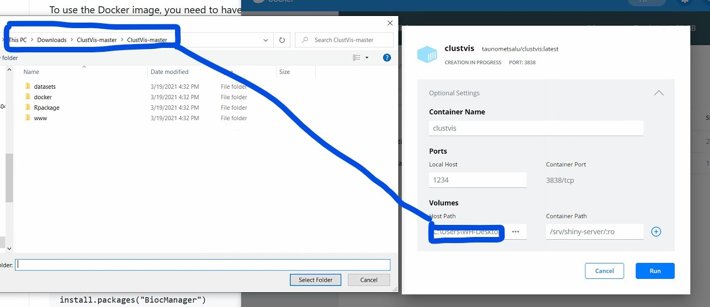

# ClustVis
Souce code of [ClustVis](http://biit.cs.ut.ee/clustvis/) web tool.

The code is distributed under GNU GPLv3. If you are interested in other licensing options, please contact the author.

## Docker image

To run ClustVis locally, you can use a snapshot of ClustVis [Docker image](https://hub.docker.com/r/taunometsalu/clustvis/) from Docker Hub. You can also try to build the image from the Dockerfile but ClustVis code may not work correctly with the newest versions of the R packages if the changes have broken backward compatibility.

To use the Docker image, you need to have [Docker](https://www.docker.com/) installed. Then use the following code:

```
sudo docker pull taunometsalu/clustvis
mkdir ~/customClustvis/
cd ~/customClustvis/
wget https://github.com/taunometsalu/ClustVis/archive/master.zip
unzip master.zip
chmod -R go+rx ~/customClustvis/
sudo docker run -d \
	--name customClustvis \
	-p <myPort>:3838 \
    -v ~/customClustvis/ClustVis-master/:/srv/shiny-server/:ro \
    taunometsalu/clustvis
```

ClustVis should then be running on ```<myURL>:<myPort>```.

Alternatively, you can start the container with Docker Desktop:

1. Pull Docker image with command:
```
sudo docker pull taunometsalu/clustvis
```
2. Download this github project and unzip.
3. Open Docker Destop, find taunometsalu/clustvis under Images and click Run.
4. Fill in the customer name, port and the location of the ClustVis-master folder as the Host path. Then fill the container path: /srv/shiny-server/:ro



## R package
To start using ClustVis R package, you can look at the examples in the vignette that comes with the package:

```
install.packages("BiocManager")
BiocManager::install("pcaMethods")
library(devtools)
install_github("taunometsalu/pheatmap")
install_github("taunometsalu/clustvis/Rpackage", build_vignettes = TRUE)
vignette("vignette", "clustvis")
```
